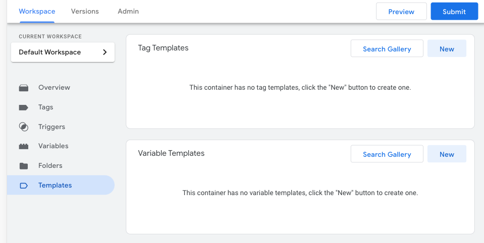
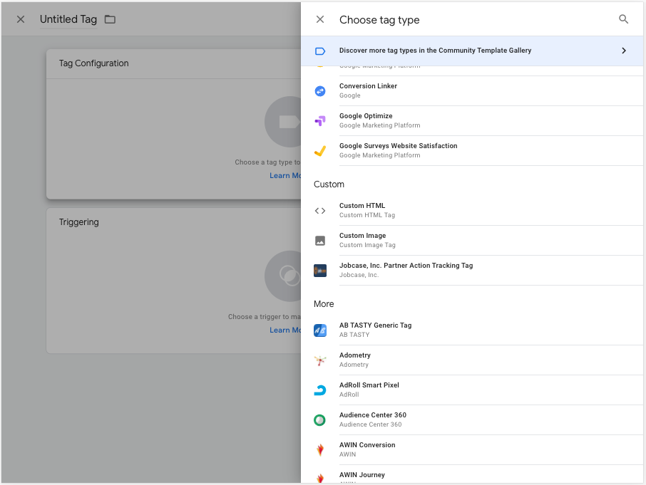
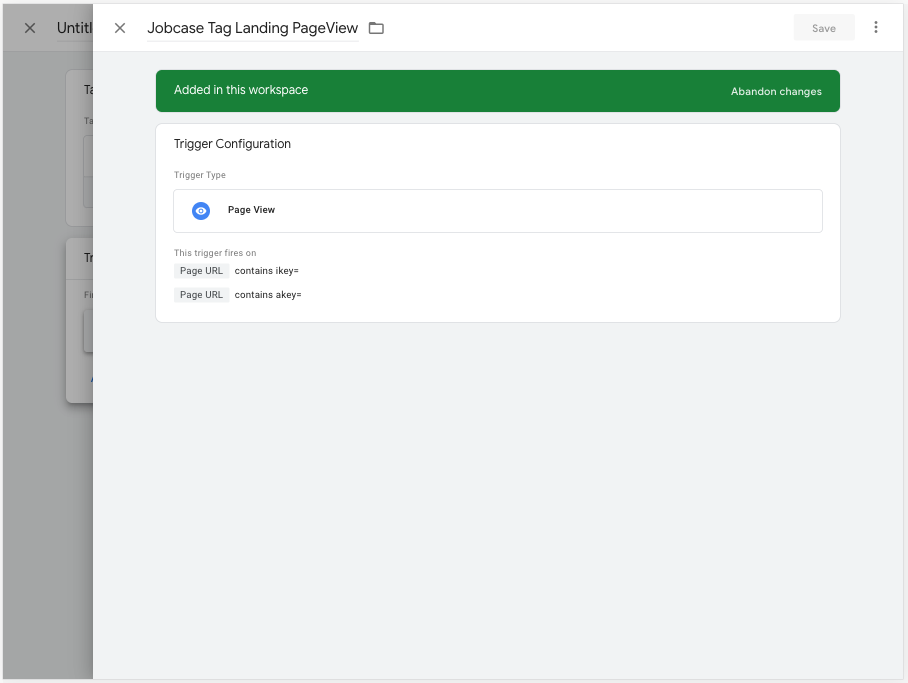
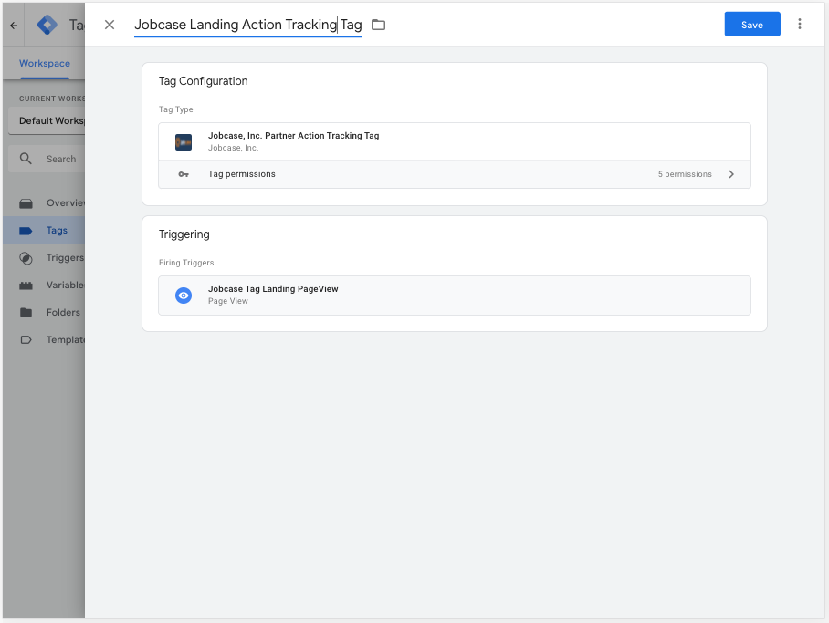
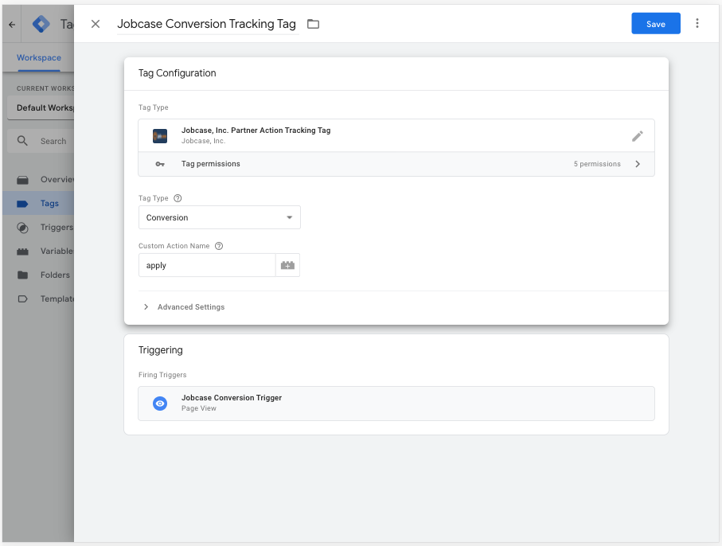

## README

### Jobcase, Inc. Partner Action Tracking Tag Setup
Jobcase, Inc. Partner Action Tracking Tag is used to provide attribution based on an action taken by the user on a partner site.

#### Steps to implementation the tag.
1. Within Google Tag Manager, click on **"Templates"** tab, then click **"Search Gallery"** button, search for **"Jobcase, Inc. Partner Action Tracking Tag"**, and then click **"Add to Workspace"**.

2. Start by creating a new tag. In the tag configuration => choose tag type, search for **"Jobcase, Inc. Partner Action Tracking Tag"** custom tag

  * Add trigger named ex: "Jobcase Tag Landing PageView trigger" of **Page View** trigger type and add conditions
"Page URL" contains "ikey="
and
"Page URL" contains "akey="

Save the Tag as "Jobcase Landing Action Tracking Tag"

3. Similar to step1, import **"Jobcase, Inc. Partner Action Tracking Tag"** custom tag,but set the
 **Tag Type = Conversion**
 and
 **Custom Action Name = {Partner Configured Action Name}** (ex: apply)
 Configure the trigger action corresponding to the action taken by the user.

